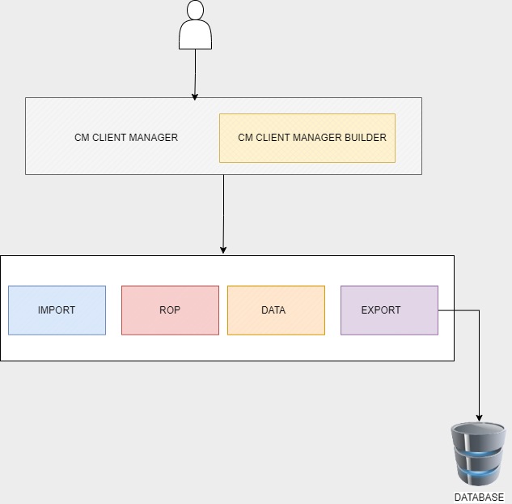
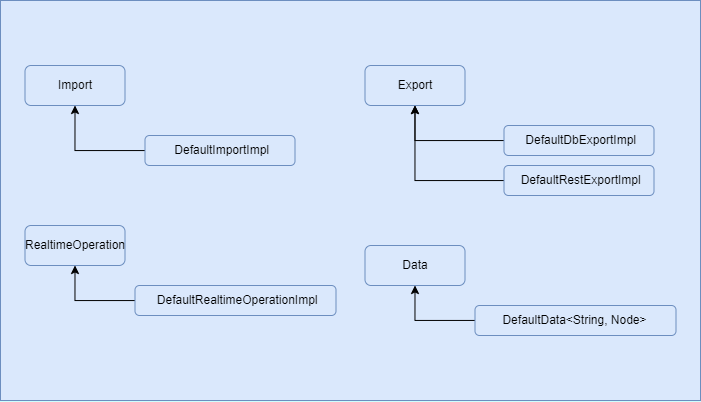
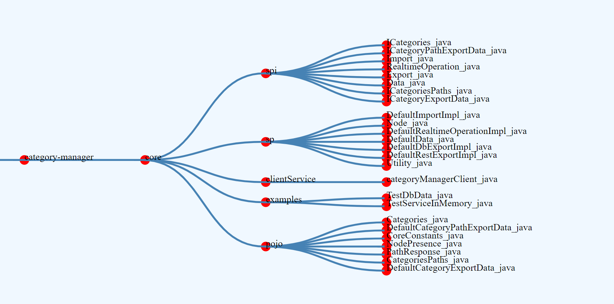

# CATEGORY MANAGER

<h2>Table of contents</h2>
<li><a href="#overview">Overview</a></li>
<li> <a href="#usage">Setup</a></li>
<li> <a href="#purpose">Purpose and Problem statement</a></li>
<li> <a href="#features">Capability and features</a></li>
<li> <a href="#design">Design architecture</a></li>
<li> <a href="#configurability">Configurations </a></li>
<li> <a href="#concepts">Brief on concepts, algorithms used in the library</a></li>
<li> <a href="#example">Example Project Reference</a></li>
<li> <a href="#thank-you-note">Thank you note</a></li>
<li> <a href="#contact">Contact details</a></li>

##### 

<h3> Overview </h3>

    Category Manager is a simple, easy to use , configurable, extendable and efficient solution to store, manage categorical / hierarchical 
    information of your business in memory of your application. And also export the same across systems through rest API's to maintain 
    data consistency across systems and databases.

##### 

<h3> Setup </h3>

First export USERNAME=YOUR_GITHUB_USERNAME and TOKEN=GITHUB_PRIVATE_TOKEN with package read privilages

Add the below dependency in your maven POM file

    <dependency>
      <groupId>com.github.sudarshan</groupId>
      <artifactId>category-manager</artifactId>
      <version>0.1.0-BETA</version>
    </dependency>

If you are using Gradle, add this to your dependency

        implementation "com.github.sudarshan:category-manager:${categoryManagerVersion}"

##### 

<h3> Purpose and Problem statement </h3>

Applications of e-commerce, healthcare, educational institutes or any general system have categorical information.
It's very valuable to store, retrieve and manage this information time efficiently and accurately. And have consistent data across multiple
teams in case of large system with the least delay, Be able to export data for review.  
And also to view the information in the relative upper and lower hierarchy, trace the data back to its origin or its leaf nodes.
Category manager provides solution to achieve all these.

##### 

<h3> Capability and features </h3>

<b> You can ,</b>
<li>
    Import your existing hierarchical data from Db. Or start from scratch - build the hierarchy structure using Rest API wrapper around this library.
    I've already provided you with a <a href="https://github.com/category-manager/category-manager-ui" target="_blank"> descent UI tool</a>
    with <a href="https://github.com/category-manager/product-details"> springboot backend </a> to get started .
</li>
<li>
    Perform realtime CRUD operation on the data.
</li>
<li>
    Export node information, Export Paths.
 
    Export could be a Json to serve API request or into any database table. 
</li>

##### 

<h3>Design / architecture </h3>
 
</img>
 
Design / architecture
 

<li>
<b> Import, Export, RealtimeOperation, Data </b> these are the interfaces which define the structure and features provided by 
    its service providers.
</li>
<li>
    <b> CategoryManagerClientBuilder </b> is used to configure the Import, Export operations. These configuration involve <i>db connection object, 
    db-import query, row mappers for imports and export-db-query and prepared statement mappers for exports respectively.</i>
</li>
<li>
    <b> CategoryManagerClient </b> gives you access to operations objects to perform import, export, realtime operations on the data.
</li>

 
</img>
 
Core spi
 

<li>
<b> Import operation </b>, reads, builds in-memory data-structure for the data imported and make it global for other operations
    to operate on.
</li>
<li>
<b> Export operation  has 2 default implementation. 1. RestExport 2. DbExport. </b>
With rest export you can retrieve information regarding any category that is in-memory, generate its ancestor and 
descendant paths in the JSON format.
</li>
<li>
<b> Db export </b> basically does similar operation as Rest Export, and exports the generated data into Db tables as configured.
</li>
<li>
<b>Realtime operation </b> lets you do add, update, delete the nodes at highest abstraction level, but the underneath involves the concept of NodePresence,
the way we classify the data, relinking the sub-tree/graph on each operation which will be discussed further in the concepts section of this page. 
</li>

 
</img>
Project files structure
 

##### 

<h3>Configuration</h3>

    &nbsp As discussed above, these interfaces are merely a specification, you can implement your own classes suiting your 
    requirements if any.
    Or you simply extend the existing DefaultImplementation and override subset of the methods.
     
    &nbsp As of now you cannot register your implementation into clientManager , meaning you would have to implement clientManager
    if you decide to go with your implementation for any operations.
 
    &nbsp  In future release you will be able to register your implementation of any operation into the operations registry which will be provided.  

<h4>Builder config </h4>

        CategoryManagerClient
            .getBuilder()
            .configureImport(connection, IMPORT_SQL, getImportRowMapper())
            .configureDbExport(
                connection,
                EXPORT_ALL_CATEGORY_SQL,
                EXPORT_CATEGORY_ALL_PATH_SQL,
                EXPORT_CATEGORY_SQL,
                EXPORT_CATEGORY_PATH_SQL,
                getExportCategoryPsMapper(),
                getExportCategoryPathPsMapper()
            );

<h4>Export Configs </h4>

    private static BiFunction<PreparedStatement, ICategoryPathExportData, PreparedStatement> getExportCategoryPathPsMapper() {
        return (ps, data) -> {
            try {
                Connection connection = ps.getConnection();
                DefaultCategoryPathExportData d = (DefaultCategoryPathExportData)data;
                String categoryId = d.getCategoryId();
                List<String> ancestorPaths = d.getAncestorPaths();
                ps.setString(1, categoryId);
                ps.setArray(2, connection.createArrayOf("text", ancestorPaths.toArray()));
                ps.setTimestamp(3, new Timestamp(ZonedDateTime.now().toInstant().toEpochMilli()), Calendar.getInstance(TimeZone.getTimeZone("UTC")));
                ps.setTimestamp(4, new Timestamp(ZonedDateTime.now().toInstant().toEpochMilli()), Calendar.getInstance(TimeZone.getTimeZone("UTC")));

            } catch(SQLException sqlException) {
                log.error(sqlException.getMessage());
            }
            return ps;
        } ;
    }

    private static BiFunction<PreparedStatement, ICategoryExportData, PreparedStatement> getExportCategoryPsMapper() {
        return (ps, data) -> {
            try {
                var d = (DefaultCategoryExportData)data;
                String categoryId = d.getCategoryId();
                Node node = d.getNode();
                Connection connection = ps.getConnection();
                ps.setString(1, categoryId);
                ps.setString(2, node.getData().toString());
                ps.setArray(3, connection.createArrayOf("text",node.getParents().toArray()));
                ps.setArray(4, connection.createArrayOf("text",node.getChildren().toArray()));
                ps.setTimestamp(5, new Timestamp(ZonedDateTime.now().toInstant().toEpochMilli()), Calendar.getInstance(TimeZone.getTimeZone("UTC")));
                ps.setTimestamp(6, new Timestamp(ZonedDateTime.now().toInstant().toEpochMilli()), Calendar.getInstance(TimeZone.getTimeZone("UTC")));

            } catch (SQLException sqlException) {
                log.error(sqlException.getMessage());
            }
            return ps;
        } ;
    }
<h4>Import Configs </h4>

    private Function<ResultSet, Node> getImportRowMapper() {
        return (rs) -> {
            Node node = new Node();
            try {
                String id = rs.getString("id");
                String name = rs.getString("name");
                var mapper = new ObjectMapper();
                var objNode = mapper.createObjectNode();
                objNode.put("name", name);
                JsonNode data = objNode;
                String[] parentCategoryIds = (String[]) rs.getArray("parent_category_ids").getArray();
                if(Objects.isNull(parentCategoryIds)) {
                    parentCategoryIds = new String[0];
                    log.info("found null as parent for {}",id);
                }
                node.set_id(id);
                node.setChildren(new HashSet<>());
                node.setParents(new HashSet<>(Arrays.asList(parentCategoryIds)));
                node.setData(data);
                return node;
            } catch (SQLException e) {
                log.error(e.getMessage());
            }
            return node;
        };
    }

##### 

<h3>Brief on concepts, algorithms used in the library</h3>

<h4>internal DS segregation </h4>
<li>
    &nbsp Internally the nodes (data) is separated as Root nodes, linked nodes and unlinked nodes.
    <ol>
        <li>
            Root node are the first level nodes that are directly connected to `head` node.
        </li>
        <li>
            Linked nodes are the descendants of the `head` nodes.
        </li>
        <li>
            Unlinked nodes are descendants of `unlinked` nodes (deleted nodes).
        </li>
    </ol>
</li>
&nbsp Root nodes cannot have any parent other than `head`. Whereas other nodes can have multiple parents at any 
level and also be part of unlinked path.
<li>

    ex:
        (linked paths ) head -> cat1 -> cat4 -> cat31
        (unlinked paths) unlinked -> cat5 -> cat31

 In the above example, notice how cat31 is part of both linked and unlinked paths. since cat4, cat5 are parents of cat31.
cat4 is a linked node and cat5 in an unlinked node.
</li>

<h4> how does the subtree-relink happen ? </h4>
<ol>
    <li>
        On every CRUD realtime operation, relink function is executed to segregate the nodes into linked/unlinked/roots respectively.
    </li>
    <li>
        Node segregation is decided based on the NodePresence. based on whether the ancestors are part of linked path or unlinked, 
        NodePresence of a node is decided.
    </li>
    <li>
        The operation uses DFS to traverse the tree for subtree relink process.
    </li>
</ol>

<h4> dfs traversal, multi parent and single parent </h4>
<ul>
    <li>
        Its intuitive that a node/category could have multiple parents, say, in an ecommerce category catalog, a category called `shirts`
        can fall under, clothing, top-wear, men, women categories. Hence this type of data hierarchy is supported.
    </li>
    <li>
        DFS algorithm is heavily used for the construction of category/node paths, be it ancestor or descendant paths.
    </li>
    <li>
        Also the algorithm handles any directed-cyclic paths . But it's better to be careful and prevent any cyclic link creation
        while updating the parent of any node.
    </li>
</ul>

<h4> Rules on category creation, deletion, update </h4>
<ul>
    <li>
        In RealtimeOperation, while adding a new node, you cannot add parents that are not already existing.
        All the parent nodes should be created before adding child nodes.
    </li>
    <li>
        In ImportOperation from db, head is considered as the default parent, If the referenced parent is absent,
        parents array is empty or null. If node Id and its parent id are same then it is considered a root node and 
        `head` is assigned as parent.
    </li>
    <li>
        Also if a nodes contains `head` or `unlinked` as parents then node should be either root node or unlinked node (deleted node).
        parents array cannot have `head`,`unlinked` with any other node reference.
    </li>
    <li>
        When a node is deleted, its parent is changed to `unlinked` and all its existing parents are removed.
    </li>
</ul>
        
    examples for valid path:
        1. 
            head <-- node1 <---[node4, node7] 
                                node4 <---- node5   
        2.
            unlinked <-- cat11
            head <-- cat 17 <--- [cat39, cat11] <--- cat42

    example for invalid path
        1. 
            head <--- node1
            unlinked <--- node1
        2.
            head <-- node1 <---[node4, unlinked] <-- node5

##### 

    <h3>Example Project Reference</h3>
    
 
        Wish you had a project to refer to ?
     
        Yes ? , 
        &nbsp I've already created project using angular and spring-boot, which serves the purpose of demonstrating few
        features / possibilities of the library in a visually appealing way. Application shows the segregation of roots, 
        linked, unlinked nodes, displays ancestor paths, descendant paths in a Tidy tree visualization.
         
         
        You can also perform CRUD operation from the UI.
         
         
        Go check it out !! and let me know your thoughts.
         
        <a href="https://github.com/category-manager/category-manager-ui" target="_blank"> link to Angular repo </a>
        and <a href="https://github.com/category-manager/product-details"> link to springboot backend </a> to get you started.
    

##### 

    <h3>Future Plans</h3>
    

        Stay connected, watch and star the repo for upcoming updates.
        Future release plans will be updated soon.
    

##### 

    <h3>Thank you !</h3>
    
<b> Thank you for taking interest, hope my work contributes to your application, makes life easier and becomes part 
    of your programming journey ^ ^ </b> 

##### 

    <h3>Let's Stay Connected !! </h3>
    <ul>
        <li>
            Here is the link to my <a href="https://www.linkedin.com/in/sudarshan-bhat-52052a173/" target="_blank"> LinkedIn </a>
        </li>
        <li>
            You can write to me <a href="mailto:sudarshanrbhat.srb2@gmail.com" target="_blank"> on Gmail  </a>
        </li>
    </ul>

